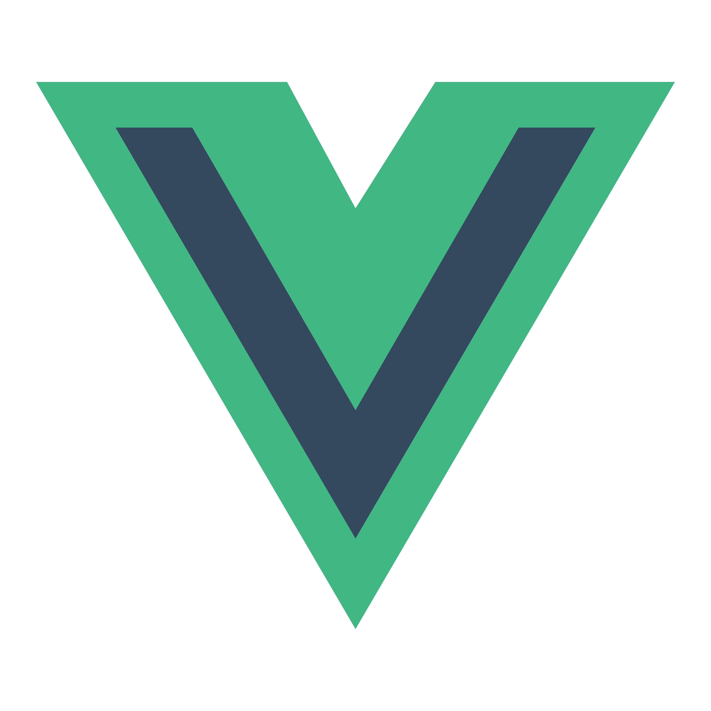

<h1 align="center">My Portfolio</h1> 
  

## Summary
Learn everything you need to know about me as a full-stack web developer and dive into some of my most recent projects.
This site was created purely through the front end using HTML, CSS, and Javascript with a mobile-first design.

#
#
## Table of Contents
- [Portfolio](#Portfolio)
- [LinkedIn](#Linkedin)
- [License](#license)
- [Challenges](#challenges)
- [Technologies](#technologies)
- [Link](#link)

#
#
## Portfolio

 
 

						

#
#
## License
This Project is covered by the [MIT] license

#
#

## Challenges
The main challenge for this site was positioning all sections to stay properly formatted and look visually appealing. The second challenge that followed closely behind was creating media queries in order for the site to mantain a strong appearance on both desktop and mobile.

#
#
## Technologies

		  
		
		  
		  
		  
		  
		

		  
		  
			
			
			
			  
				
  

## Link 
This is the live URL/link to My [Portfolio](https://lbladma.github.io/My_Portfolio/).

#
#

## LinkedIn  

 <a href="https://www.linkedin.com/in/taoufika/" target="_blank"> 