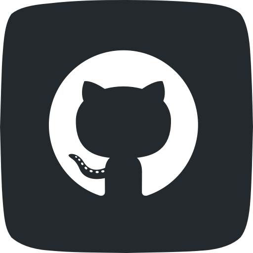
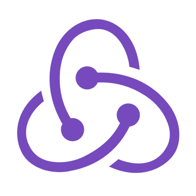

<h1 align="center">My Portfolio</h1> 

## Summary
This portfolio is the result of my continues hard work and sleepless nights to learn and master most tools that were covered in this course. This porfolio is a showcase my personal porjects that I worked on during this course.
Throughout this portfolio, Some projects that I worked on include but are not limited to Technologies, and skills I learned using advanced CSS and Html, JS, Node, React and many coding tools.

#
#
## Table of Contents
- [Portfolio](#Portfolio)
- [LinkedIn](#Linkedin)
- [License](#license)
- [Challenges](#challenges)
- [Technologies](#technologies)
- [Link](#link)

#
#
## Portfolio

 
 

						

#
#
## License

#
#

## Challenges
There are many challenges that i faced working on this project. However, I was able to overcome most of them either by searching online and by asking for help. 
The main challenge I faced was formatting and styling the elements within the site. 
The other main challenge I faced was debugging and cleaning the code after I finished working on the site.

#
#
## Technologies

	
		 
  
#
#

## Link 
This is the live URL/link to My [Portfolio](https://lbladma.github.io/My_Portfolio/).

 #
 #

## My LinkedIn
This is My LinkedIn page

 <a href="https://www.linkedin.com/in/taoufika/" target="_blank"> 
